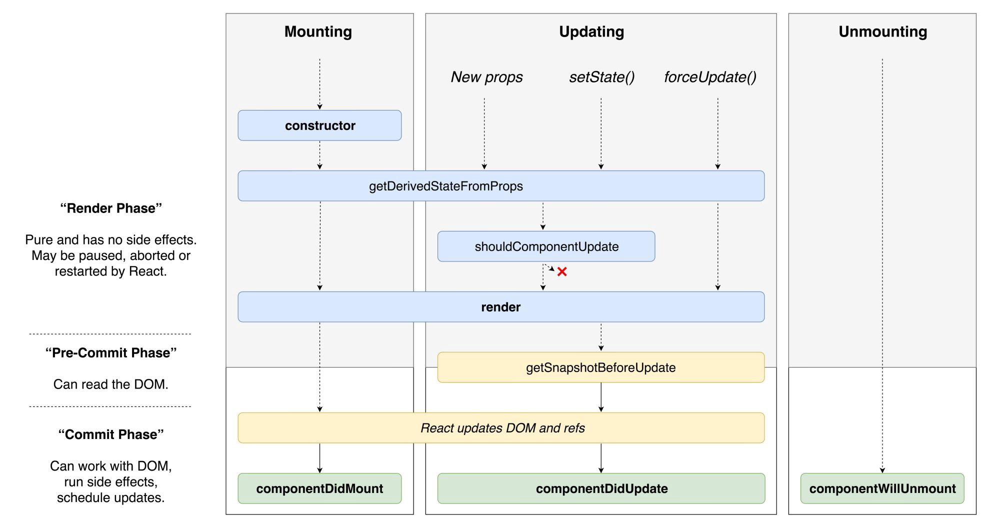

The React team was working asynchronous rendering for about a year, and as you know, React 16.3 was released each month. This version recommended that some life methods be used with prefix UNSAFE.
The reason for this is to indicate that these methods are removed from use in the next major update.

* UNSAFE_componentWillMount
* UNSAFE_componentWillUpdate
* UNSAFE_componentWillReceiveProps

The reason for the removal from use is the incorrect use of these methods in asynchronous applications.
Dan’s Twitter share featured a new React lifestyle diagram that is compatible with React 16.4.

I will add what I will describe in the article with the aim of being a reference:



# The new lifecycle:

* getDerivedStateFromProps
* getSnapshotBeforeUpdate

## static getDerivedStateFromProps(nextProps, prevState)

The new method getDerivedStateFromProps is a static function and is used instead of componentWillReceiveProps with React 16.3.

This method is called after a component is instantiated and when the component receives new props. Since it is a static method, you cannot access this inside this method neither you can access any other class method. If there is no change in your values, you should return null or {}.

## componentWillReceiveProps

```jsx
class List extends React.Component {
  componentWillReceiveProps(nextProps) {
    if (nextProps.selected !== this.props.selected) {
      this.setState({ selected: nextProps.selected });
      this.selectNew();
    }
  }

  // ...
}
```

In the example above with componentWillReceiveProps, we see that the component has updated this.setState state and that this side-effect has been updated by calling this.selectNew ()

## getDerivedStateFromProps

Now let’s look at the use of getDerivedStateFromProps for the same example. Instead of using this.setState as in our first example, we updated the state directly. If there is no update, it returns null.

In some cases, we may need more than one state change when the method is called. In that case, we use componentDidMount. Once with the execute condition, our method works immediately after calling.

```jsx
class List extends React.Component {
  static getDerivedStateFromProps(props, state) {
    if (props.selected !== state.selected) {
      return {
        selected: props.selected,
      };
    }

    return null;
  }

  componentDidUpdate(prevProps, prevState) {
    if (this.props.selected !== prevProps.selected) {
      this.selectNew();
    }
  }

  // ...
}
```

## getSnapshotBeforeUpdate(prevProps, prevState)

One of our new methods, getSnapshotBeforeUpdate, generally covers the workspaces of componentWillMount. In short, the virtual DOM is used before being reflected in the DOM.

```jsx
getSnapshotBeforeUpdate(prevProps, prevState) { … }
```

Although it is not a static method, it is foreseen to return a value in the recommended use. This value is used as a third argument in the `componentDidUpdate` method.

```jsx
componentDidUpdate(prevProps, prevState, snapshot) { … }
```

In which situations is it used? The answer to the question can be used in the component updates that are re-rendered to protect the current DOM’s position when scrolling.

# References:

* https://twitter.com/dan_abramov/status/981712092611989509
* https://alligator.io/react/get-derived-state/
* https://larry-price.com/blog/2018/06/27/how-to-use-getderivedstatefromprops-in-react-16-dot-3-plus/
* https://hackernoon.com/replacing-componentwillreceiveprops-with-getderivedstatefromprops-c3956f7ce607
* https://medium.com/@baphemot/whats-new-in-react-16-3-d2c9b7b6193b
* https://scotch.io/bar-talk/exciting-new-features-react-163-bye-componentwillreceiveprops-hello-new-context-api
* https://code.likeagirl.io/understanding-react-component-life-cycle-49bf4b8674de
* https://medium.com/@baphemot/understanding-react-react-16-3-component-life-cycle-23129bc7a705

